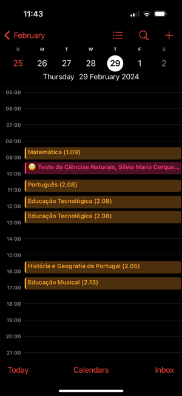
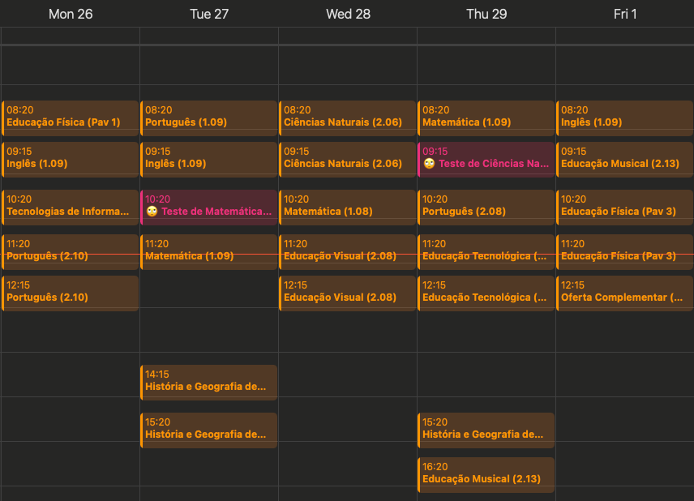

# 👩‍🎓 EduConnect 
Google Firebase project to create student calendars from Inovar+

## About The Project
Parents who have used the *InovarAluno* app probably know that obtaining information from it is not very enjoyable. I wanted to have easy access to my daughter's lesson schedule, and even more importantly, an overview of scheduled assessments with alerts. What could be better than integrating these into the phone's calendar?

#### Advantages
- Define the content of the calendar (only lessons, only assessments, or both).
- Easily access the subscribed calendar across various devices.
- Receive alerts for scheduled assessments (7 days, 2 days, and 1 day before)."

#### How to
- Open the Calendar app
- New Calendar Subscription
- Paste the EduConnect Calendar URL

## Images

|iPhone|Mac| 
|-|-| 
|||

## Usage
- All secrets are expected to be defined in the `secrets.js` file.
- Deploy this repository to your Firebase project.
- Use the `scope` URL parameter to define the content of the calendar (`ASSESSMENTS`, `LESSONS` or `ALL`)

## Contact
Any questions, please feel free to contact me at meik.schuetz@gmail.com
